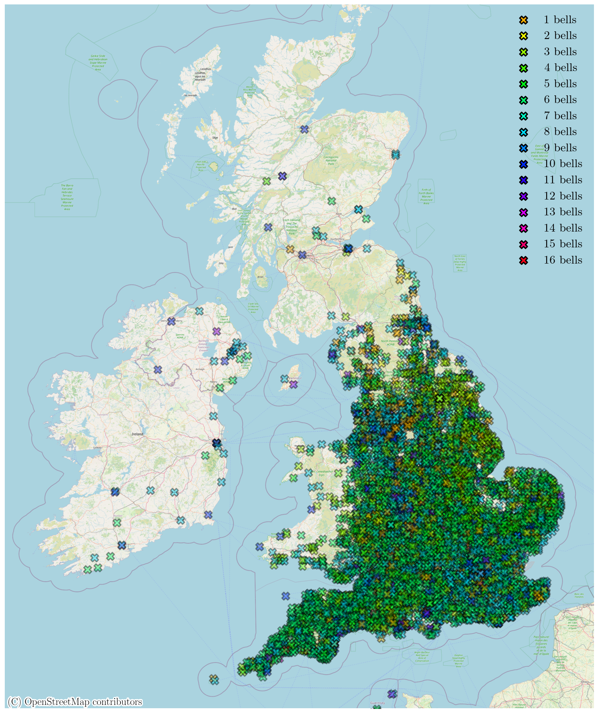
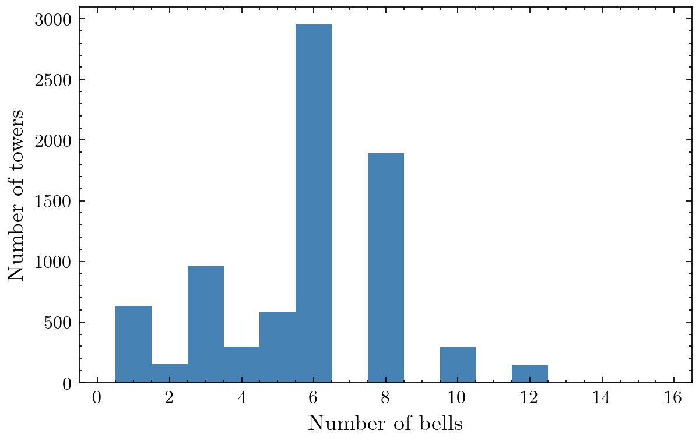
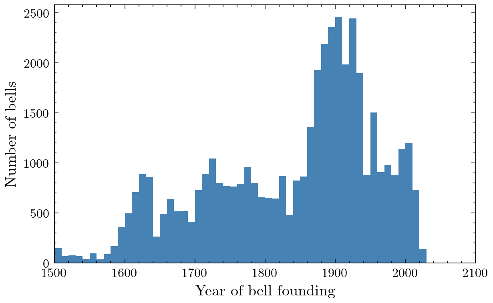
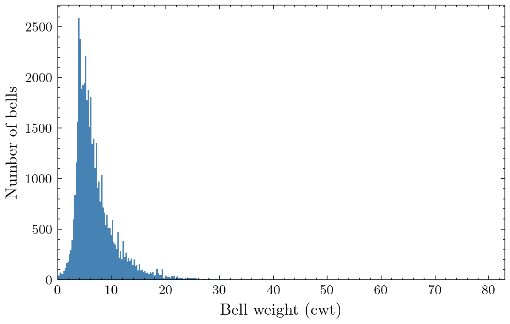
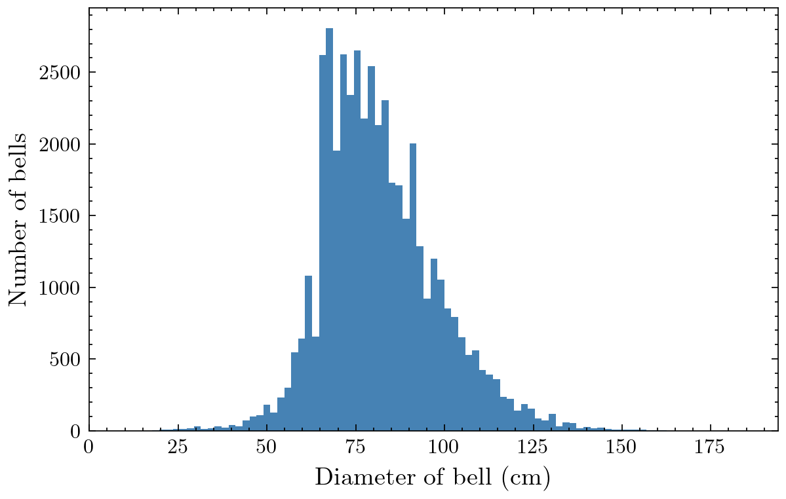
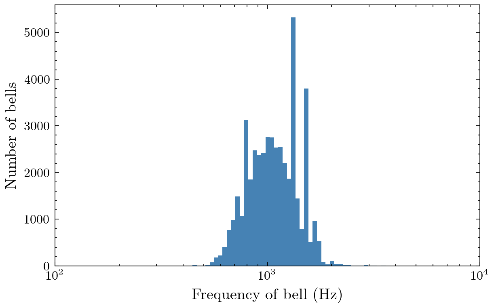

# Bellpedia
<br />
<p align="center">
  <a href="https://github.com/sephwalker321/Bellpedia">
  </a>
</p>


<!-- TABLE OF CONTENTS -->
<details open="open">
  <summary>Table of Contents</summary>
  <ol>
    <li>
      <a href="#about-the-project">About The Module</a>
      <ul>
        <li><a href="#built-with">Built With</a></li>
      </ul>
    </li>
    <li>
      <a href="#getting-started">Getting Started</a>
      <ul>
        <li><a href="#prerequisites">Prerequisites and Installation</a></li>
      </ul>
    </li>
    <li><a href="#usage">Usage</a></li>
    <li><a href="#examples">Examples</a></li>
    <li><a href="#license">License</a></li>
    <li><a href="#contact">Contact</a></li>
  </ol>
</details>


<!-- ABOUT THE PROJECT -->
## About The Project

<p align="center">
  <a href="https://github.com/sephwalker321/Bellpedia">
  </a>
</p>

Python module to explore change bell ringing bell towers throughout the UK and the world.

### Built With

The module was constructed using the following libraries,
* [Python](https://www.python.org/)

* [OpenStreetMap](https://www.openstreetmap.org/#map=6/54.910/-3.432)

The bell tower information is collated directly from Dove's Guide,

* [Dove's Guide](https://dove.cccbr.org.uk/)

<!-- GETTING STARTED -->
## Getting Started

To get a local copy up and running follow these simple example steps.

### Prerequisites and Installation

This is an example of how to list things you need to use the software and how to install them.

1. Clone the repo,
   ```
   git clone https://github.com/sephwalker321/Roadmaps.git
   ```

2. Running the install script,
  Linux:
  ```
  ./install_Linux.sh
  ```
  Windows:
  ```
  install_Windows.bat
  ```

3. Source the virtual environment,
  Linux:
  ```
  source venv/bin/activate
  ```
  Windows:
  ```
  venv\Scripts\activate
  ```

Alternatively see *requirements.txt* and install manually. 
<!-- USAGE EXAMPLES -->
## Usage
A Jupyter Notebook is provided for the collation of data and plotting.

1. Notebooks/quickstart.ipynb example data manipulation and plotting.

User tower infomation can be used to create a list containing all tower information. Example excel sheet can be found in my_data/ and its use is demonstraighted in the quickstart notebook.

## Examples
Here are some example plots generated across all full-circle ring bell towers.

<p align="center">

</p>

A set of summary histograms can also be produced:

<p align="center">

</p>


<p align="center">

</p>

<p align="center">

</p>


<p align="center">

</p>


<p align="center">

</p>


<!-- LICENSE -->
## License

Distributed under the Creative Commons Attribution 4.0 International Public License. See `LICENSE` for more information.


<!-- CONTACT -->
## Contact

For any issues or questions contact Joseph Walker

Project Link: [https://github.com/sephwalker321/Bellpedia.git](https://github.com/sephwalker321/Bellpedia.git)
